# Курсовой проект «Симулятор гонок»

Курсовой проект — простейшая реализация симулятора гонок для фэнтезийных транспортных средств (ТС).

## Содержание

### 1. Правила игры
Все ТС делятся на два типа:
 - наземные;
 - воздушные.
 
В симуляторе есть несколько видов ТС:
 - верблюд (наземное);
 - верблюд-быстроход (наземное);
 - кентавр (наземное);
 - ботинки-вездеходы (наземное);
 - ковёр-самолёт (воздушное);
 - орёл (воздушное);
 - метла (воздушное).

У всех ТС есть заранее заданная скорость.

В симуляторе есть несколько видов гонок:
 - только для наземных ТС;
 - только для воздушных ТС;
 - для наземных и воздушных ТС.

#### Наземные ТС
Наземные ТС не могут двигаться непрерывно: после определённого времени им нужно отдыхать. У каждого вида наземного ТС время движения своё. Время отдыха у каждого наземного ТС также различается и зависит от того, какая по счёту эта остановка.

##### Пример 
Скорость ТС равна 100 км/ч, дистанция равна 1000 км, время движения до отдыха равно 6 ч, длительность отдыха равна 3 ч. В таком случае ТС пройдёт дистанцию за 1000 / 100 = 10 ч. Так как время движения до отдыха равно 6 часов, то по пути ТС нужно будет отдохнуть 1 раз. Итоговое время составит: 10 + 3 = 13 ч.

Сводная таблица характеристик для каждого наземного ТС:

| Вид ТС           | Скорость | Время движения до отдыха| Длительность отдыха
|------------------|----------|----------------------------|--------------------
| Верблюд          | 10       | 30                         | Первый раз: 5 Все последующие разы: 8
| Верблюд-быстроход| 40       | 10                         | Первый раз: 5 Второй раз: 6.5 Все последующие разы: 8
| Кентавр          | 15       | 8                          | Всегда 2
| Ботинки-вездеходы| 6        | 60                         | Первый раз: 10 Все последующие разы: 5

#### Воздушные ТС
Воздушные ТС двигаются непрерывно. Так как они могут облетать препятствия, каждое воздушное ТС имеет собственный коэффициент сокращения расстояния: то есть для каждого воздушного ТС дистанция, которую нужно пройти, уменьшается. Коэффициент сокращения расстояния может зависеть от дистанции.

##### Пример 
Если у воздушного ТС коэффициент сокращения расстояния равен 5%, то вместо дистанции в 1000 км ему нужно пройти дистанцию в 1000 * 0.95 = 950 км.

Сводная таблица характеристик для каждого воздушного ТС:

| Вид ТС           | Скорость | Коэффициент сокращения расстояния
|------------------|----------|----------------------------------
| Ковёр-самолёт    | 10       | Если расстояние меньше 1000 — без сокращения Если расстояние меньше 5000 — 3% Если расстояние меньше 10000 — 10% Если расстояние больше или равно 10000 — 5%
| Орёл             | 8        | Всегда 6%
| Метла            | 20       | Увеличивается на 1% за каждую 1000 у.е. расстояния Например, для расстояния 5600 коэффициент будет 5%

### 2. Требования к решению

Требования по функционированию программы:
1. При старте программы пользователю должен быть предложен выбор типа гонки.
2. После выбора типа гонки пользователь должен указать расстояние для этой гонки.
3. Пользователю должна быть предоставлена возможность зарегистрировать ТС на гонку.
4. Можно регистрировать не более одного экземпляра для каждого вида ТС.
5. На гонку должно быть зарегистрировано хотя бы два вида ТС.
6. Нельзя зарегистрировать на наземную гонку воздушное ТС, а на воздушную гонку наземное ТС.
7. После завершения регистрации пользователь может либо зарегистрировать ещё ТС, либо начать гонку.
8. Сама гонка происходит мгновенно. Пользователю выводится результат гонки — ТС-участники гонки и их время.
9. Результаты участников должны выводиться по возрастанию времени: самый быстрый оказывается вверху списка, самый медленный — внизу.
10. Вместе с результатами гонки пользователю должен быть предложен выбор: провести ещё одну гонку (программа стартует заново) или выйти из программы.

Требования к структуре и реализации программы:
1. Для реализации ТС и гонок должны быть использованы иерархии классов.
2. Для каждого класса должна быть создана пара «заголовочный файл + файл исходного кода».
3. Классы ТС, гонок и другие вспомогательные классы должны находиться в отдельной динамической библиотеке (DLL).
4. В основном проекте (.exe) должен находиться код для взаимодействия с пользователем и использование классов из вашей библиотеки в ответ на действия пользователя.
5. Классы библиотеки не должны самостоятельно выводить данные на консоль.

### 3. Пример пошаговой работы программы

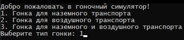

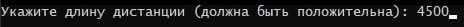

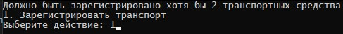

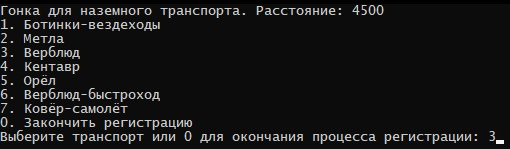

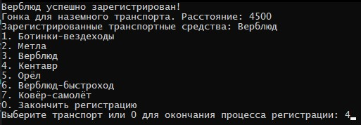

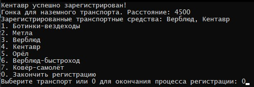

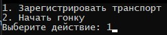

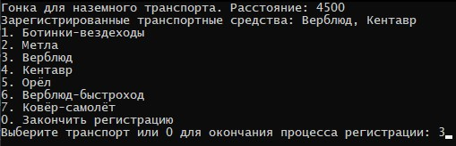

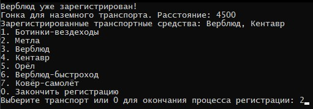

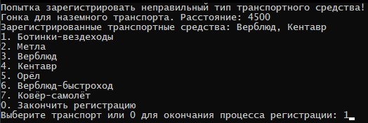

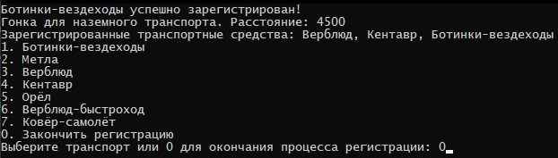

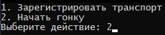

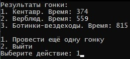

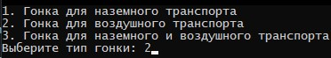

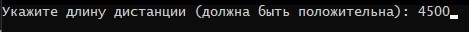

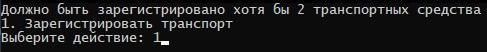

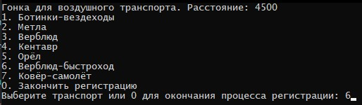

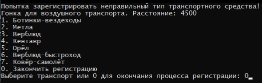

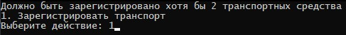

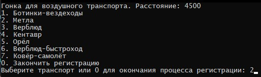

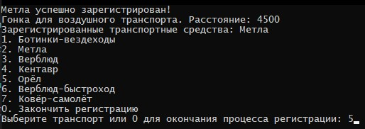

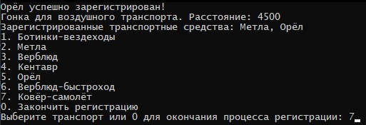

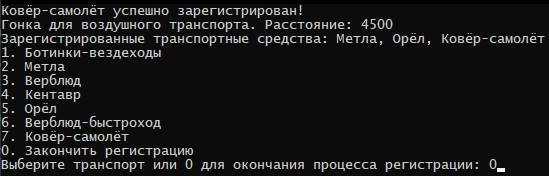

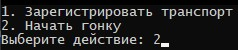

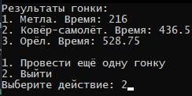

### Задание*
Вы можете выполнить курсовую работу на CMake.

______

### Как задавать вопросы руководителю по курсовой работе

1. Если у вас возник вопрос, попробуйте сначала самостоятельно найти ответ в интернете. Навык поиска информации пригодится вам в любой профессиональной деятельности. Если ответ не нашёлся, можно уточнить у преподавателя.
2. Если у вас набирается несколько вопросов, присылайте их в виде нумерованного списка. Так преподавателю будет проще отвечать на каждый из них.
3. Для лучшего понимания контекста прикрепите к вопросу скриншоты и стрелкой укажите, что именно вызывает вопрос. Программу для создания скриншотов можно скачать [по ссылке](https://app.prntscr.com/ru/).
4. По возможности задавайте вопросы в комментариях к коду.
5. Формулируйте свои вопросы чётко, дополняя их деталями. На сообщения «Ничего не работает», «Всё сломалось» преподаватель не сможет дать комментарии без дополнительных уточнений. Это затянет процесс получения ответа. 
6. Постарайтесь набраться терпения в ожидании ответа на свои вопросы. Преподаватели Нетологии — практикующие разработчики, поэтому они не всегда могут отвечать моментально. Зато их практика даёт возможность делиться с вами не только теорией, но и ценным прикладным опытом.  

Рекомендации по работе над курсовой работой:

1. Не откладывайте надолго начало работы над курсовым проектом. В таком случае у вас останется больше времени на получение рекомендаций от преподавателя и доработку проекта.
2. Разбейте работу над курсовым проектом на части и выполняйте их поочерёдно. Вы будете успевать учитывать комментарии от преподавателя и не терять мотивацию на полпути. 

______

### Инструкция по выполнению курсовой работы

1. Выполняйте работу в [GitHub](https://github.com/).
2. Скопированную ссылку с вашей курсовой работой нужно отправить на проверку. Для этого перейдите в личный кабинет на сайте [netology.ru](http://netology.ru/), в поле комментария к курсовой вставьте скопированную ссылку и отправьте работу на проверку.
3. Работу можно сдавать частями.

### Критерии оценки курсовой работы

1. В личном кабинете прикреплена ссылка с кодом курсовой работы.
2. В ссылке содержится код, который при запуске выполняет описанный в задании алгоритм.
